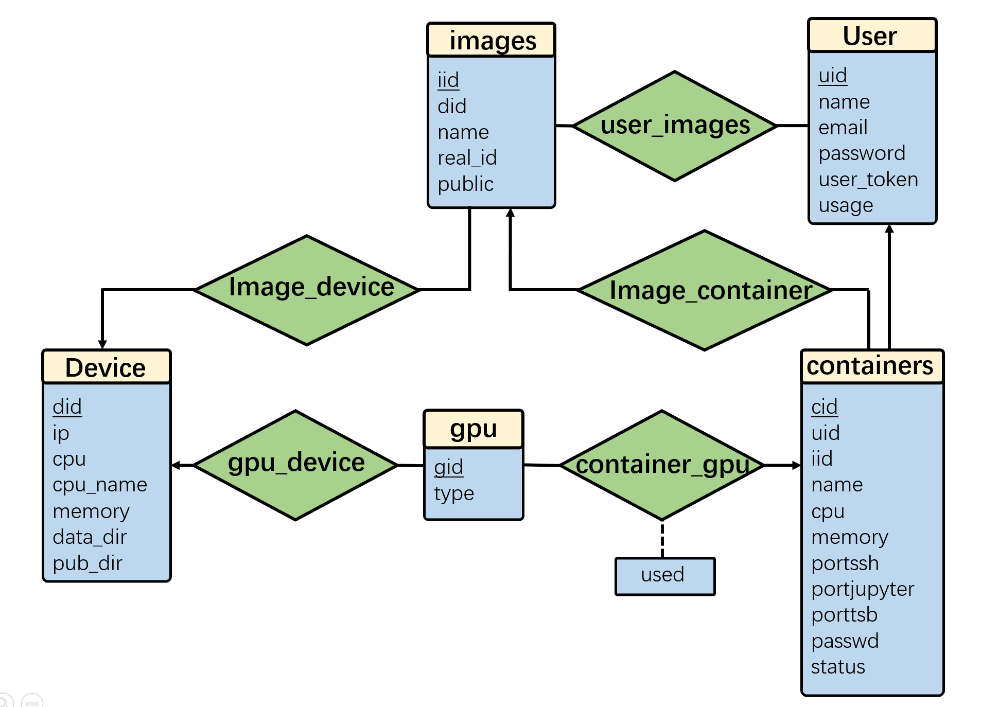
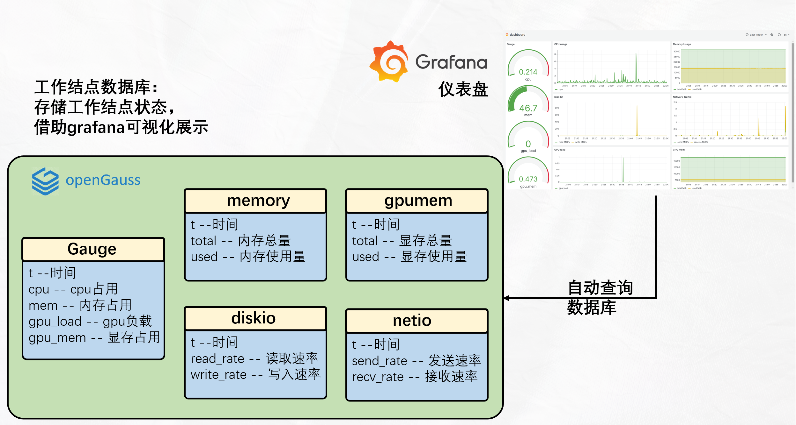

# 数据库

本项目使用[open-gauss](https://opengauss.org/zh/)作为数据库

## 数据库部署

采用docker部署open-gauss数据库，参考 [https://github.com/xy3xy3/openeuler-openGauss-docker-forstudy](https://github.com/xy3xy3/openeuler-openGauss-docker-forstudy)

要实现数据库数据的持久化，需要进行目录挂载，将容器内的`/opt/openGauss/data`目录挂载到宿主机。直接挂载会导致数据库崩溃，因为该目录存放了数据库启动的必要数据，解决方案是先启动一个临时容器，将该目录的内容拷贝到宿主机，然后再进行目录挂载。完整指令如下：

```bash
docker run -d --name temp-opengauss xy3666/opengauss:6.0.0-openEuler
docker cp temp-opengauss:/opt/openGauss/data ./data
docker stop temp-opengauss
docker rm temp-opengauss
sudo chmod -R 700 ./data
sudo chown -R 1000:1000 ./data
docker run -d \
    -p 5432:5432 \
    --name opengauss-container \
    -v ./data:/opt/openGauss/data \
    xy3666/opengauss:6.0.0-openEuler
```

## python api

python后端程序通过opengauss的python api连接到数据库，完成增删改查操作

安装python api：

```bash
pip install psycopg2-binary
```

为了便于维护后端代码，操作数据库的代码被封装成了下面的python类

```python
from psycopg2 import connect
import psycopg2

class OpenGaussConnector:
    def __init__(self, host, port, user, pwd, database) -> None:
        params = {
            'database': database,
            'user': user,
            'password': pwd,
            'host': host,
            'port': port
        }
        self.conn = connect(**params)
    
    def exec(self, cmd:str):
        with self.conn:
            with self.conn.cursor() as cursor:
                cursor.execute(cmd)
                try:
                    result = cursor.fetchall()
                except psycopg2.ProgrammingError as e:
                    if str(e).strip() == 'no results to fetch':
                        return None
                    else:
                        raise e
        return result
    
    def get_one_res(self, cmd:str):
        res = self.exec(cmd)
        if len(res) == 0:
            return None
        elif len(res) > 1:
            raise Exception(f"more than 1 result, cmd={cmd}")
        else:
            return res[0]
```

在创建`OpenGaussConnector`类时需要提供远程登录到数据库的必要信息，之后只需要调用`exec`或`get_one_res`方法，即可执行SQL语句，并获取返回结果

`exec`方法会以元组列表的形式返回执行结果，`get_one_res`方法调用`exec`方法，但是默认数据库应当只返回一条数据，返回形式为一个元组或`None`

使用示范：

```python
db = OpenGaussConnector(
    host=DB_IP,
    port=DB_PORT,
    user=DB_USER,
    pwd=DB_PWD,
    database=DB_CONNECT_DB
)
cmd = 'SELECT * FROM pg_tables where tableowner = \'superuser\';'
res = db.exec(cmd)
print(res)
```

## 控制器数据库

控制器上的数据库需要管理整个系统运行的必要数据，E-R图如下



### User 表

用于存储用户的基本信息，包括用户名、邮箱、密码等，同时包含用户的访问令牌和使用时长信息

| 属性名     | 类型                         | 解释              |
| ---------- | ---------------------------- | ----------------- |
| uid        | int(主键)                    | 用户ID           |
| name       | VARCHAR(255) UNIQUE NOT NULL | 用户名           |
| email      | VARCHAR(255) NOT NULL        | 用户邮箱         |
| password   | VARCHAR(64) NOT NULL         | 密码             |
| user_token | VARCHAR(64)                  | 访问令牌         |
| usage      | INT NOT NULL                 | GPU使用时长（暂不启用） |

---

### gpu 表

用于记录GPU设备的基本信息，包括GPU的唯一标识和型号。

| 属性名 | 类型              | 解释     |
| ------ | ----------------- | -------- |
| gid    | int(主键)         | GPU ID   |
| type   | VARCHAR(255)      | GPU型号  |

---

### device 表

用于存储worker结点的信息，包括设备ID、IP地址、CPU核心数量、CPU型号、内存大小以及数据盘和公共数据的路径。

公共数据路径是可选的。如果worker结点上存放了常用的数据集，可以将该目录记录在数据库中，容器启动时会自动挂载指定路径，便于用户使用公共数据集。

| 属性名    | 类型             | 解释               |
| --------- | ---------------- | ------------------ |
| did       | int(主键)        | 设备ID            |
| ip        | VARCHAR(255)     | IP地址            |
| cpu       | int NOT NULL     | CPU核心数量       |
| cpu_name  | VARCHAR(256)     | CPU型号           |
| memory    | int NOT NULL     | 可用内存（MB）    |
| data_dir  | VARCHAR(256) NOT NULL | 数据盘位置      |
| pub_dir   | VARCHAR(256)     | 公共数据位置（可选） |

---

### gpu_device 表

用于关联GPU和设备的关系，表示某GPU属于某设备。

| 属性名 | 类型         | 解释            |
| ------ | ------------ | --------------- |
| gid    | int(外键)    | GPU ID          |
| did    | int(外键)    | 设备ID          |

---

### images 表

用于管理设备上的镜像信息，包括镜像的名称、实际ID、所属设备，以及是否公开的标志。

| 属性名  | 类型                         | 解释                     |
| ------- | ---------------------------- | ------------------------ |
| iid     | int(主键)                    | 镜像ID                  |
| did     | int(外键) NOT NULL           | 设备ID                  |
| name    | VARCHAR(255) NOT NULL        | 镜像名称                |
| real_id | VARCHAR(255) NOT NULL        | 镜像实际ID              |
| public  | BOOLEAN NOT NULL             | TRUE 为公开镜像, FALSE 为私有镜像 |

---

### user_images 表

用于记录用户和镜像之间的关联关系，表示用户对哪些镜像有控制权限（用于删除镜像）。

| 属性名 | 类型         | 解释            |
| ------ | ------------ | --------------- |
| uid    | int(外键)    | 用户ID          |
| iid    | int(外键)    | 镜像ID          |

---

### containers 表

用于管理容器的信息，包括容器的所属用户、使用的镜像、分配的资源（CPU和内存）、映射的端口、访问密码以及容器的运行状态。

| 属性名     | 类型                         | 解释                          |
| ---------- | ---------------------------- | ----------------------------- |
| cid        | int(主键)                    | 容器ID                       |
| uid        | int(外键) NOT NULL           | 用户ID                       |
| iid        | int(外键) NOT NULL           | 镜像ID                       |
| name       | VARCHAR(255) NOT NULL        | 容器名称                     |
| cpu        | int NOT NULL                 | 分配的CPU数量                |
| memory     | int NOT NULL                 | 分配的内存大小（MB）         |
| portssh    | int NOT NULL                 | SSH映射端口                  |
| portjupyter| int NOT NULL                 | Jupyter映射端口              |
| porttsb    | int NOT NULL                 | TensorBoard映射端口          |
| passwd     | VARCHAR(255) NOT NULL        | SSH和Jupyter访问密码         |
| status     | VARCHAR(10) NOT NULL         | 状态 (running, exited)       |

---

### container_gpu 表

用于记录容器和GPU之间的映射关系，标明某个容器使用了哪些GPU及是否正在被使用。

| 属性名 | 类型         | 解释             |
| ------ | ------------ | ---------------- |
| cid    | int(外键)    | 容器ID           |
| gid    | int(外键)    | GPU ID           |
| used   | int NOT NULL | 是否正在被使用    |

## 工作结点数据库

每个工作结点上都部署有open-gauss数据库，用于记录该节点的实时资源使用状态



### gauge 表

用于记录设备的综合监控指标，包括CPU、内存、GPU负载及GPU内存的使用情况。

| 属性名    | 类型          | 解释               |
| --------- | ------------- | ------------------ |
| t         | DATE          | 记录的时间         |
| cpu       | float(30)     | CPU使用率          |
| mem       | float(30)     | 内存使用率         |
| gpu_load  | float(30)     | GPU负载使用率      |
| gpu_mem   | float(30)     | GPU内存使用率      |

---

### memory 表
用于记录设备内存的总量和使用情况。

| 属性名    | 类型          | 解释               |
| --------- | ------------- | ------------------ |
| t         | DATE          | 记录的时间         |
| total     | float(30)     | 内存总量（MB）     |
| used      | float(30)     | 已使用内存（MB）   |

---

### gpumem 表
用于记录GPU内存的总量和使用情况。

| 属性名    | 类型          | 解释               |
| --------- | ------------- | ------------------ |
| t         | DATE          | 记录的时间         |
| total     | float(30)     | GPU内存总量（MB）  |
| used      | float(30)     | 已使用GPU内存（MB）|

---

### diskio 表
用于记录设备磁盘的IO性能，包括读写速率。

| 属性名    | 类型          | 解释               |
| --------- | ------------- | ------------------ |
| t         | DATE          | 记录的时间         |
| read_rate | float(30)     | 磁盘读速率（MB/s） |
| write_rate| float(30)     | 磁盘写速率（MB/s） |

---

### netio 表
用于记录设备的网络IO性能，包括发送和接收速率。

| 属性名    | 类型          | 解释               |
| --------- | ------------- | ------------------ |
| t         | DATE          | 记录的时间         |
| send_rate | float(30)     | 网络发送速率（MB/s）|
| recv_rate | float(30)     | 网络接收速率（MB/s）|