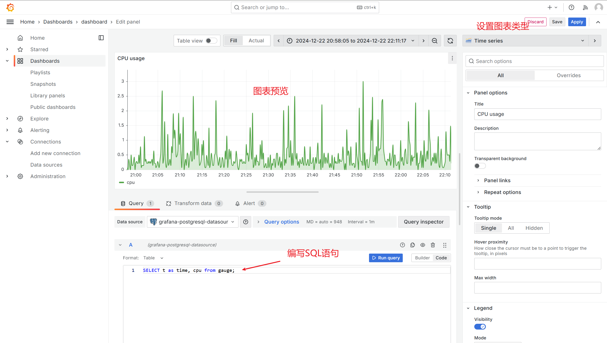

# grafana实现

以下介绍使用grafana展示仪表盘的实现细节

## 架构

在每个工作节点上都部署有open-gauss数据库和grafana服务。工作结点上会运行监控程序，将实时状态数据存放在数据库里，而grafana通过查询数据库获取监控数据，绘制仪表盘

## grafana配置

首先需要添加数据源，配置open-gauss数据库的访问地址和登录密码。

然后只需给每个图表设定查询语句和图表样式，如下图

用户看到的前端是由多个图表拼接而成的，成为Dashboard。只需调整各个图表的排版，并设置公开可见性，就得到了仪表盘

## 持久化

grafana的配置以sqlite的形式存储在容器中，在完成上述配置后，需要将其中的sqlite文件保存，在构建新容器时复制到容器内，即可实现配置的持久化