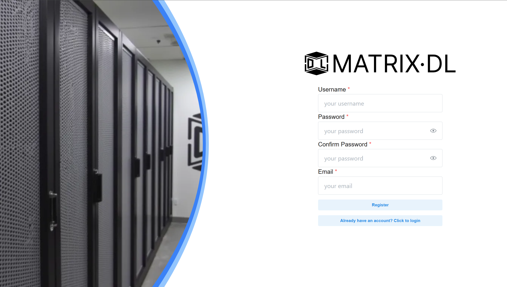
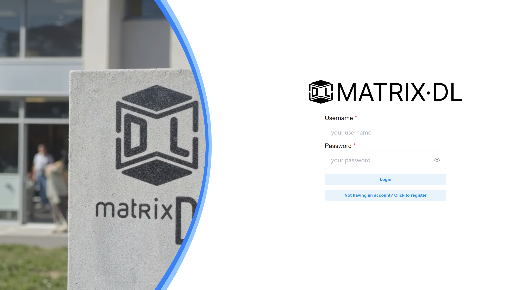
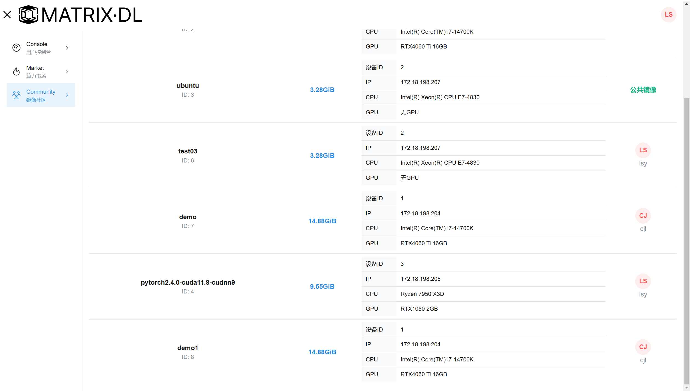
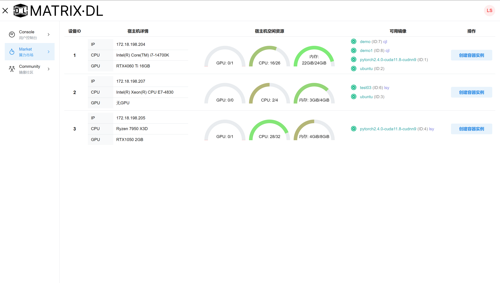
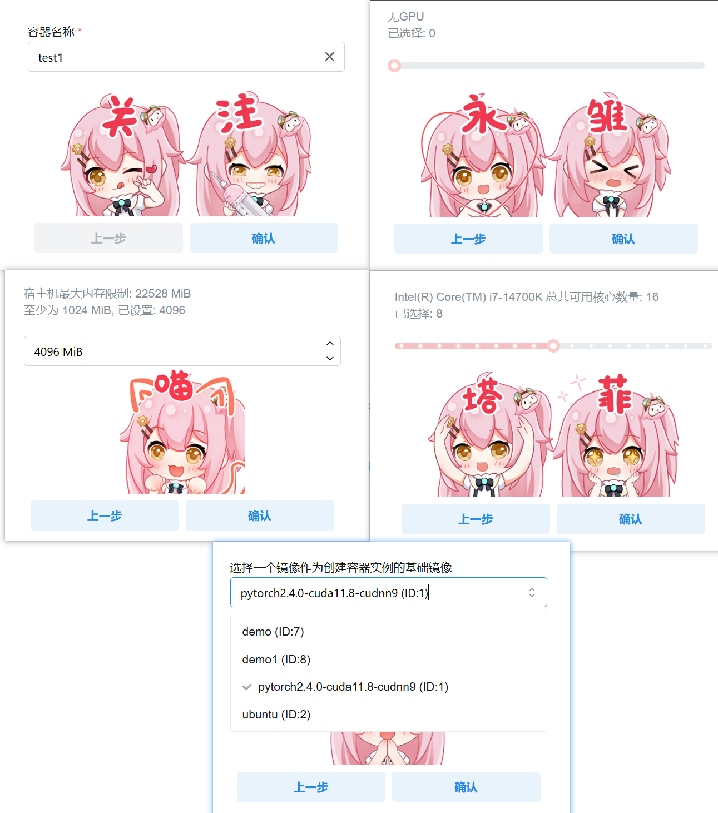
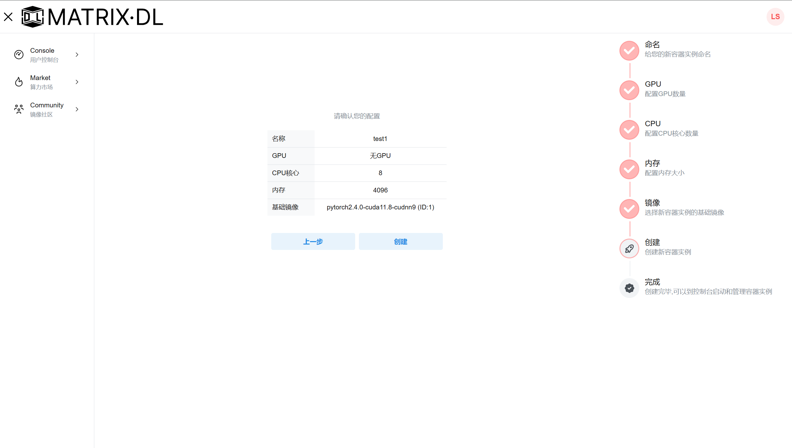
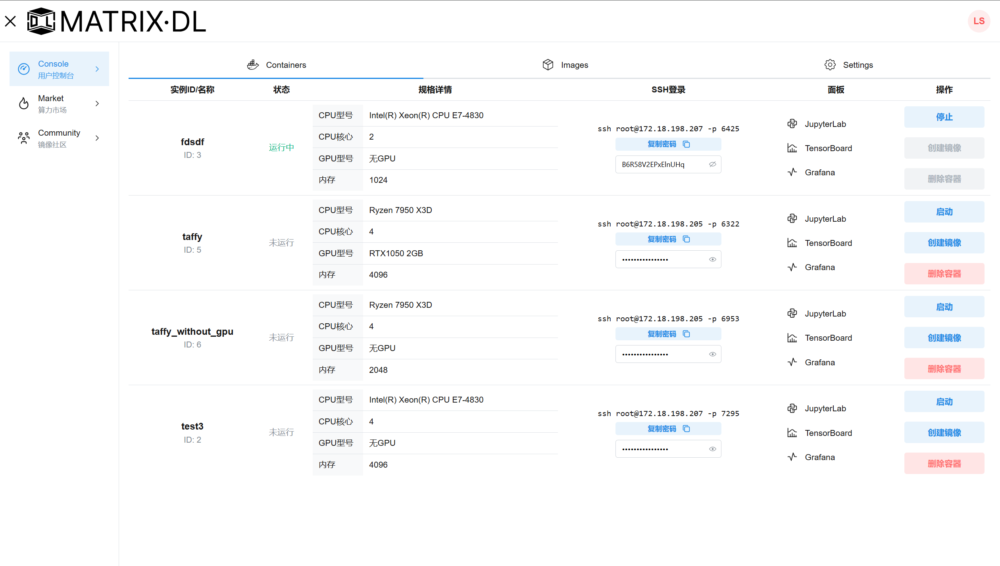
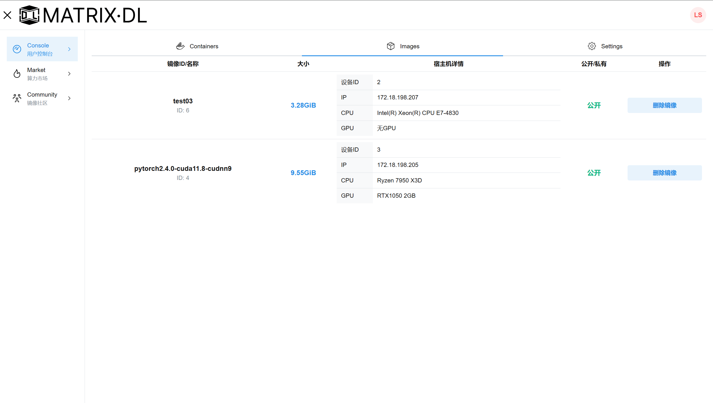

# 功能界面

## 注册

新用户输入用户名、密码、确认密码、邮箱后即可注册

## 登录

## 镜像社区

镜像社区展示了所有可用的镜像，包括公共镜像和用户创建并分享的镜像

对于每个镜像，都具有镜像ID、镜像名称、镜像大小、所属设备等属性。

## 算力市场

### 主页
算力市场的主页展示所有工作结点，每个结点具有IP地址、CPU型号、GPU型号等属性，以及当前空闲资源和可用镜像

### 创建实例

点击创建容器实例，进入创建界面

选择所需的CPU、内存、GPU等硬件配置，系统的数据库会记录每台工作结点的资源使用情况，限制用户申请的资源数量，避免工作结点负载过高。

## 控制台
### 容器管理

容器实例的管理包括创建、启动、停止、删除、创建镜像等操作

控制台列出用户的所有容器实例，每个容器具有容器名、状态、资源限额、端口映射、登录密码等配置。

每个容器都提供ssh访问指令、jupyterLab/tensorboard/grafana访问链接

用户可以从容器创建镜像，保存配置好的环境。在创建的过程中，可以设置镜像公开还是私有，对于公开镜像能够被其他用户在镜像社区访问。

### 镜像管理

用户从容器创建的镜像能够在此页面管理

