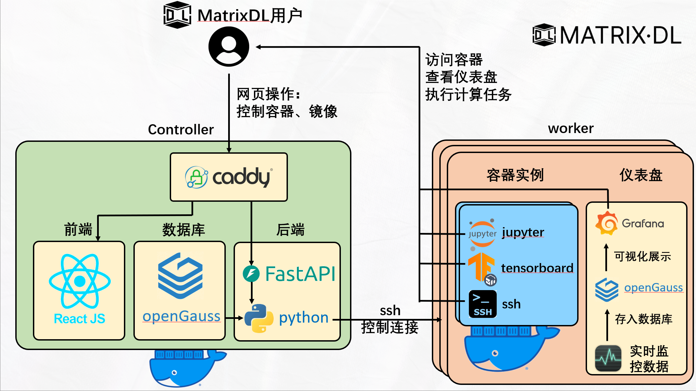

SysuMatrixDL (Sysu Matrix Deep Learning)是一个分布式算力市场平台

为什么要开发这个项目？ <del>为了提交数据库大作业，</del> 考虑到当下GPU算力在人工智能训练和推理中的作用日益重要，已经成为广大学生的刚需，本项目的灵感来自于GPU算力租用平台AutoDL，旨在给中大学生提供CPU/GPU算力(免费)租用服务。
## 访问MatrixDL

借助cloudflare的内网穿透服务，可以通过 [https://matrixdl.fuusen.space/](https://matrixdl.fuusen.space/) 访问MatrixDL。

cloudflare只能完成网页的内网穿透，在MatrixDL上创建的容器实例只能在中大校园网内访问，所以我们建议您在中大校园网内体验MatrixDL的全部功能
## 架构

MatrixDL由单个控制结点(controller)和多个工作结点(worker)组成，架构图如下

### 控制结点

用户的所有网页请求会发往控制结点，由[caddy](https://caddyserver.com/)实现反向代理，分别发往前端和后端处理

在控制结点上，前端由[react](https://react.dev/)实现，后端由python的[FastAPI库](https://fastapi.tiangolo.com/)实现

在控制结点上运行有一个[openGauss](https://opengauss.org/zh/)数据库，管理整个系统运行的必要数据

控制节点通过ssh安全连接到工作结点，执行容器、镜像的管理指令
### 工作结点

工作结点以docker容器的形式运行用户创建的实例，容器中运行jupyter, ssh等服务，并且提供tensorboard的端口转发，用户可以通过工作结点的ip和指定端口访问容器

为了便于用户了解工作结点的运行状态，每个工作结点上都运行有一个[openGauss](https://opengauss.org/zh/)数据库。本工作结点的实时运行状态数据，包括CPU，内存，网络，IO，GPU等，会以固定的时间间隔存到数据库中。

借助[grafana](https://grafana.com/)，可以为用户提供美观的前端仪表盘。每个工作结点上的grafana会连接到本结点的数据库，执行查询操作，并绘制图表展示实时运行数据。

